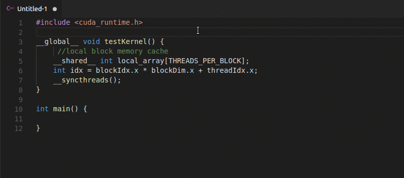

# CUDA for VSCode

This extension aims at providing support for CUDA (C++) in VS Code.

## Features

### Code coloring

This extension supports most of the basic CUDA keywords and functions, such as but not limited to :

- cudaMalloc, cudaFree, ...
- \_\_global\_\_, \_\_device\_\_, \_\_host\_\_, ...
- atomicAdd, atomicSub, surfCubemapLayeredread, ...
- \_\_shfl_down, \_\_syncthreads, ...

### CUDA snippets

The following snippets are available :

- **\_\_s** : __syncthreads();
- **cmal** : cudaMalloc((void**)&${1:variable}, ${2:bytes});
- **cmalmng** : cudaMallocManaged((void**)&${1:variable}, ${2:bytes});	
- **cmem** : cudaMemcpy(${1:dest}, ${2:src}, ${3:bytes}, cudaMemcpy${4:Host}To${5:Device});
- **cfree** : cudaFree(${1:variable});
- **kernel** : \_\_global\_\_ void ${1:kernel}(${2})
- **thrusthv** : thrust::host_vector<${1:char}> v$0;
- **thrustdv** : thrust::device_vector<${1:char}> v$0;

## Requirements

- VSCode 1.18+. Slightly older versions should work, very old versions are not guaranteed to work.
- This extension has been tested with the default VSCode skin (dark+) and the popular One Dark Pro theme. 

## Extension Settings

Include if your extension adds any VS Code settings through the `contributes.configuration` extension point.

For example:

This extension contributes the following settings:

* `myExtension.enable`: enable/disable this extension
* `myExtension.thing`: set to `blah` to do something

## Known Issues

- No support for Intellisense navigation through code (right click->Go to definition,...). For now, you must change the file type to C++ to have it. This will be improved in next release, needs research.

## Planned features

Below are listed the features that ideally should be available in this extension. There is no guarantees this features will be implemented, so feel free to fork this project and propose pull requests.

- Intellisense basic support: go to functions definition and declaration
- CMake integration: make this extension work together with existing CMake Tools, as CMake (3.8)3.9 added official support for CUDA language
- Basic debugging: upgrade this extension to not only color code but allow for basic debugging features like breakpoints
- Full debugging support: basically allows you to uninstall nsight and develop everything CUDA inside VSCode

## Feature requests

## Release Notes

### 0.1.0

Initial release of vs-cuda extension

-----------------------------------------------------------------------------------------------------------

## Working with Markdown

**Note:** You can author your README using Visual Studio Code.  Here are some useful editor keyboard shortcuts:

* Split the editor (`Cmd+\` on OSX or `Ctrl+\` on Windows and Linux)
* Toggle preview (`Shift+CMD+V` on OSX or `Shift+Ctrl+V` on Windows and Linux)
* Press `Ctrl+Space` (Windows, Linux) or `Cmd+Space` (OSX) to see a list of Markdown snippets

### For more information

* [Visual Studio Code's Markdown Support](http://code.visualstudio.com/docs/languages/markdown)
* [Markdown Syntax Reference](https://help.github.com/articles/markdown-basics/)

**Enjoy!**